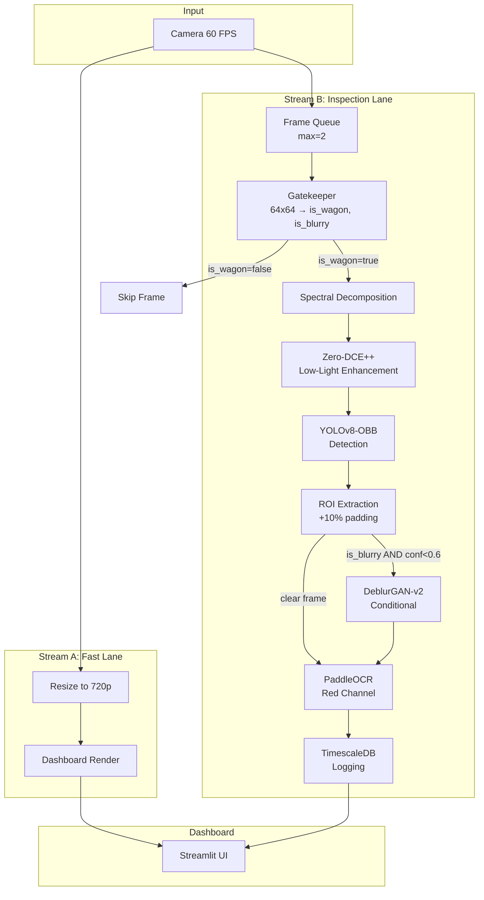
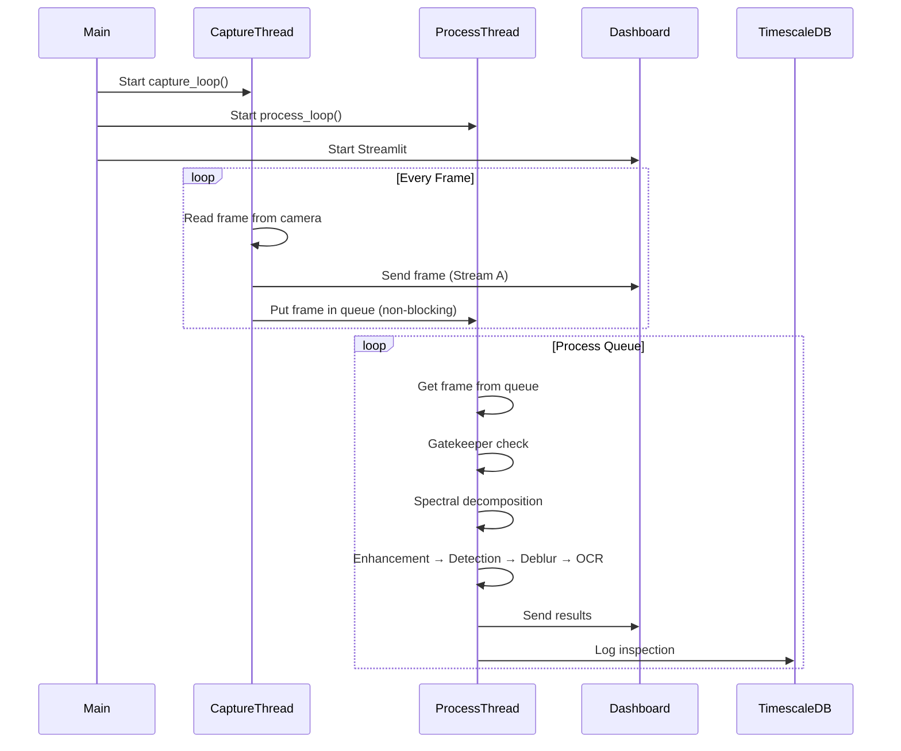

# Design Document: Iron-Sight Railway Inspection System

## Overview

Iron-Sight is an edge-native hybrid spectral pipeline for automated railway wagon inspection at high velocities (50-80 km/h). The system addresses the fundamental physics challenge of motion blur vs. light sensitivity by using high-shutter-speed capture combined with AI-powered image restoration.

The architecture employs a two-stream design:
1. **Stream A (Fast Lane)**: Real-time visualization at 60 FPS with <5ms latency
2. **Stream B (Inspection Lane)**: AI-powered detection, enhancement, deblurring, and OCR

Key innovations include spectral decomposition (red channel for OCR, saturation for damage), crop-first deblurring (85% computation reduction), and a gatekeeper pre-filter pattern for sub-millisecond frame rejection.

## Architecture

### High-Level System Architecture



### Threading Model



## Components and Interfaces

### 1. InspectionPipeline (Main Orchestrator)

```python
class InspectionPipeline:
    """
    Main orchestrator for the two-stream inspection system.
    Manages frame capture, processing threads, and model inference.
    """
    
    def __init__(self, config: PipelineConfig):
        self.frame_queue: queue.Queue[np.ndarray]  # maxsize=2
        self.result_queue: queue.Queue[InspectionResult]
        self.gatekeeper: ONNXModel
        self.zero_dce: ONNXModel
        self.yolo: ONNXModel
        self.deblur: ONNXModel
        self.ocr: PaddleOCR
        self.db: TimescaleDBClient
    
    def capture_loop(self, video_source: str) -> None:
        """Stream A: Capture frames and feed visualization + queue."""
        pass
    
    def process_loop(self) -> None:
        """Stream B: Process frames through AI pipeline."""
        pass
    
    def start(self) -> None:
        """Start both capture and processing threads."""
        pass
    
    def stop(self) -> None:
        """Gracefully stop all threads."""
        pass
```

### 2. Gatekeeper (Pre-filter)

```python
class Gatekeeper:
    """
    MobileNetV3-Small binary classifier for frame pre-filtering.
    Input: 64x64 grayscale thumbnail
    Output: (is_wagon_present: bool, is_blurry: bool)
    """
    
    def __init__(self, model_path: str):
        self.session: ort.InferenceSession
        self.input_size: tuple = (64, 64)
    
    def predict(self, frame: np.ndarray) -> tuple[bool, bool]:
        """
        Classify frame in <0.5ms.
        Returns (is_wagon_present, is_blurry).
        """
        pass
    
    def preprocess(self, frame: np.ndarray) -> np.ndarray:
        """Convert to 64x64 grayscale, normalize."""
        pass
```

### 3. SpectralDecomposer

```python
class SpectralDecomposer:
    """
    Extracts optimized channels for different processing paths.
    - Red channel: Maximum contrast for white text (OCR)
    - Saturation channel: Highlights rust/oxidation (damage detection)
    """
    
    @staticmethod
    def extract_red_channel(frame: np.ndarray) -> np.ndarray:
        """Extract red channel from BGR image."""
        return frame[:, :, 2]
    
    @staticmethod
    def extract_saturation(frame: np.ndarray) -> np.ndarray:
        """Convert to HSV and extract saturation channel."""
        hsv = cv2.cvtColor(frame, cv2.COLOR_BGR2HSV)
        return hsv[:, :, 1]
    
    def decompose(self, frame: np.ndarray) -> SpectralChannels:
        """Return both channels for parallel processing."""
        pass
```

### 4. ZeroDCEEnhancer

```python
class ZeroDCEEnhancer:
    """
    Zero-Reference Deep Curve Estimation for low-light enhancement.
    Uses physics-based curve learning, not heavy convolution.
    Target latency: 8ms, max: 15ms
    """
    
    def __init__(self, model_path: str, timeout_ms: float = 15.0):
        self.session: ort.InferenceSession
        self.timeout_ms: float
    
    def enhance(self, channel: np.ndarray) -> tuple[np.ndarray, bool]:
        """
        Enhance single-channel image.
        Returns (enhanced_image, enhancement_applied).
        Falls back to raw input if timeout exceeded.
        """
        pass
```

### 5. YOLODetector

```python
class YOLODetector:
    """
    YOLOv8-OBB nano model for wagon component detection.
    Outputs oriented bounding boxes for angled wagons.
    """
    
    CLASSES = ['wagon_body', 'wheel_assembly', 'coupling_mechanism', 'identification_plate']
    
    def __init__(self, model_path: str, conf_threshold: float = 0.35, nms_threshold: float = 0.45):
        self.session: ort.InferenceSession
        self.conf_threshold: float
        self.nms_threshold: float
        self.input_size: tuple = (640, 640)
    
    def detect(self, image: np.ndarray) -> list[Detection]:
        """
        Detect wagon components.
        Returns list of Detection(x, y, w, h, angle, confidence, class_id).
        Target latency: 15ms, max: 25ms
        """
        pass
    
    def postprocess(self, outputs: np.ndarray) -> list[Detection]:
        """Apply NMS and filter by confidence."""
        pass
```

### 6. DeblurGAN

```python
class DeblurGAN:
    """
    DeblurGAN-v2 with MobileNet-DSC backbone for motion blur correction.
    Only processes cropped regions (crop-first strategy).
    """
    
    def __init__(self, model_path: str, timeout_ms: float = 40.0):
        self.session: ort.InferenceSession
        self.timeout_ms: float
    
    def deblur(self, crop: np.ndarray) -> tuple[np.ndarray, bool]:
        """
        Deblur cropped region.
        Returns (deblurred_image, deblur_applied).
        Skips if timeout exceeded.
        """
        pass
```

### 7. OCREngine

```python
class OCREngine:
    """
    PaddleOCR Mobile v2.6 for wagon ID recognition.
    Validates against pattern [A-Z]{4}\d{6}.
    """
    
    WAGON_ID_PATTERN = re.compile(r'^[A-Z]{4}\d{6}$')
    
    def __init__(self, confidence_threshold: float = 0.80):
        self.ocr: PaddleOCR
        self.confidence_threshold: float
    
    def read(self, crop: np.ndarray) -> OCRResult:
        """
        Read text from red channel crop.
        Returns OCRResult(text, confidence, is_valid_wagon_id).
        Target latency: 25ms, max: 50ms
        """
        pass
    
    def validate_wagon_id(self, text: str) -> bool:
        """Check if text matches wagon ID pattern."""
        return bool(self.WAGON_ID_PATTERN.match(text))
```

### 8. TimescaleDBClient

```python
class TimescaleDBClient:
    """
    Client for logging inspection results to TimescaleDB.
    Falls back to SQLite if TimescaleDB unavailable.
    """
    
    def __init__(self, connection_string: str, fallback_path: str = "fallback.db"):
        self.conn: psycopg2.connection
        self.fallback_conn: sqlite3.Connection
        self.use_fallback: bool = False
    
    def log_inspection(self, result: InspectionResult) -> None:
        """Log inspection result with automatic fallback."""
        pass
    
    def health_check(self) -> bool:
        """Check database connectivity."""
        pass
```

## Data Models

### Configuration

```python
@dataclass
class PipelineConfig:
    video_source: str
    model_dir: str = "models/"
    queue_maxsize: int = 2
    gatekeeper_timeout_ms: float = 1.0
    enhancement_timeout_ms: float = 15.0
    detection_timeout_ms: float = 25.0
    deblur_timeout_ms: float = 40.0
    ocr_timeout_ms: float = 50.0
    total_timeout_ms: float = 100.0
    db_connection_string: str = ""
    fallback_db_path: str = "fallback.db"
```

### Detection Result

```python
@dataclass
class Detection:
    x: float           # Center x
    y: float           # Center y
    width: float       # Box width
    height: float      # Box height
    angle: float       # Rotation angle (OBB)
    confidence: float  # Detection confidence
    class_id: int      # Class index
    class_name: str    # Class name
```

### OCR Result

```python
@dataclass
class OCRResult:
    text: str
    confidence: float
    is_valid_wagon_id: bool
    raw_results: list[tuple[str, float]]  # All detected text with confidence
```

### Inspection Result

```python
@dataclass
class InspectionResult:
    frame_id: int
    timestamp: datetime
    wagon_id: Optional[str]
    detection_confidence: float
    ocr_confidence: float
    blur_score: float
    enhancement_applied: bool
    deblur_applied: bool
    processing_time_ms: int
    spectral_channel: str
    bounding_box: dict  # JSON-serializable OBB
    wagon_angle: float
    
    def to_db_row(self) -> dict:
        """Convert to database row format."""
        pass
```

### Spectral Channels

```python
@dataclass
class SpectralChannels:
    red: np.ndarray       # For OCR path
    saturation: np.ndarray  # For damage detection path
    original: np.ndarray   # Original BGR frame
```

### Latency Metrics

```python
@dataclass
class LatencyMetrics:
    gatekeeper_ms: float
    enhancement_ms: float
    detection_ms: float
    crop_ms: float
    deblur_ms: float
    ocr_ms: float
    total_ms: float
    
    def exceeds_budget(self, budget_ms: float = 100.0) -> bool:
        return self.total_ms > budget_ms
```

## Correctness Properties

*A property is a characteristic or behavior that should hold true across all valid executions of a system—essentially, a formal statement about what the system should do. Properties serve as the bridge between human-readable specifications and machine-verifiable correctness guarantees.*


### Property 1: Two-Stream Concurrency
*For any* running InspectionPipeline instance, both the capture thread and processing thread SHALL be alive and executing independently without blocking each other.
**Validates: Requirements 1.1**

### Property 2: Visualization Stream Latency
*For any* captured frame in the visualization stream, the time from capture to dashboard render SHALL be less than 5ms.
**Validates: Requirements 1.2**

### Property 3: Queue Overflow Behavior
*For any* sequence of frames pushed to a full Frame_Queue, the queue SHALL always contain the most recently pushed frame and drop older frames.
**Validates: Requirements 1.3**

### Property 4: Gatekeeper Classification Latency
*For any* 64x64 grayscale input to the Gatekeeper, classification SHALL complete within 0.5ms.
**Validates: Requirements 2.1**

### Property 5: Gatekeeper Output Format
*For any* input frame, the Gatekeeper SHALL return exactly two boolean values: `is_wagon_present` and `is_blurry`.
**Validates: Requirements 2.3**

### Property 6: Gatekeeper Skip Behavior
*For any* frame where Gatekeeper returns `is_wagon_present=false`, no downstream models (Zero-DCE, YOLO, DeblurGAN, OCR) SHALL be invoked.
**Validates: Requirements 2.4**

### Property 7: Spectral Decomposition Correctness
*For any* BGR image, the red channel extraction SHALL equal `frame[:,:,2]` and the saturation extraction SHALL equal the S channel of the HSV conversion.
**Validates: Requirements 3.1, 3.2**

### Property 8: Enhancement Latency and Fallback
*For any* input to Zero_DCE_Enhancer, processing SHALL complete within 15ms OR the pipeline SHALL use the raw frame as fallback.
**Validates: Requirements 4.2, 4.3, 13.1**

### Property 9: Detection Output Format
*For any* detection returned by YOLO_Detector, it SHALL include an angle value (OBB) and have confidence >= 0.35.
**Validates: Requirements 5.3, 5.5**

### Property 10: Detection Latency
*For any* input to YOLO_Detector, detection SHALL complete within 25ms.
**Validates: Requirements 5.4**

### Property 11: Conditional Deblur Invocation
*For any* detection, DeblurGAN SHALL be invoked if and only if `is_blurry=true` AND `detection_confidence < 0.6`, and SHALL only process cropped regions (not full frames).
**Validates: Requirements 6.1, 6.5**

### Property 12: Crop Padding
*For any* detected region extracted for deblurring, the crop SHALL include 10% padding on all sides.
**Validates: Requirements 6.2**

### Property 13: Deblur Latency and Fallback
*For any* input to DeblurGAN, processing SHALL complete within 50ms OR the pipeline SHALL continue with the blurry crop as fallback.
**Validates: Requirements 6.3, 6.4, 13.2**

### Property 14: Wagon ID Validation Pattern
*For any* string, the wagon ID validator SHALL return true if and only if the string matches the pattern `[A-Z]{4}\d{6}`.
**Validates: Requirements 7.3**

### Property 15: OCR Confidence Rejection
*For any* OCR result with confidence below 0.80, the reading SHALL be rejected (not returned as a valid wagon ID).
**Validates: Requirements 7.4**

### Property 16: OCR Latency
*For any* input to OCR_Engine, processing SHALL complete within 50ms.
**Validates: Requirements 7.2**

### Property 17: Inspection Logging Completeness
*For any* detected wagon, the logged record SHALL contain all required fields: frame_id, timestamp, wagon_id, detection_confidence, ocr_confidence, blur_score, enhancement_applied, deblur_applied, processing_time_ms, spectral_channel, bounding_box, wagon_angle.
**Validates: Requirements 8.1, 8.2**

### Property 18: Total Pipeline Latency and Frame Drop
*For any* frame, total processing SHALL complete within 100ms OR the frame SHALL be dropped and an incident logged.
**Validates: Requirements 9.1, 9.2**

### Property 19: Latency Tracking Per Stage
*For any* processed frame, latency metrics SHALL be recorded for each stage: gatekeeper, enhancement, detection, crop, deblur, and OCR.
**Validates: Requirements 9.3**

### Property 20: Graceful Degradation
*For any* frame where cumulative latency exceeds the budget, expensive operations (deblur, full enhancement) SHALL be skipped to meet the total latency constraint.
**Validates: Requirements 9.4**

### Property 21: Dynamic Input Shapes for DeblurGAN
*For any* crop of varying dimensions, DeblurGAN SHALL accept and process the input without requiring fixed dimensions.
**Validates: Requirements 10.3**

### Property 22: Database Fallback to SQLite
*For any* inspection result when TimescaleDB is unavailable, the result SHALL be logged to SQLite instead.
**Validates: Requirements 13.4**

### Property 23: Incident Logging for Latency Violations
*For any* model that exceeds its maximum latency by more than 20%, an incident SHALL be logged for post-mortem analysis.
**Validates: Requirements 13.5**

## Error Handling

### Timeout Handling Strategy

Each model has a defined latency budget with graceful fallback:

| Component | Target | Maximum | Fallback Action |
|-----------|--------|---------|-----------------|
| Gatekeeper | 0.5ms | 1ms | Skip frame |
| Zero-DCE++ | 8ms | 15ms | Use raw frame |
| YOLO Detection | 15ms | 25ms | Reduce resolution |
| DeblurGAN | 20ms | 40ms | Skip deblur |
| OCR | 25ms | 50ms | Return low-confidence |
| **Total** | **70ms** | **100ms** | **Drop frame** |

### Exception Handling

```python
class PipelineError(Exception):
    """Base exception for pipeline errors."""
    pass

class ModelTimeoutError(PipelineError):
    """Raised when a model exceeds its latency budget."""
    def __init__(self, model_name: str, actual_ms: float, budget_ms: float):
        self.model_name = model_name
        self.actual_ms = actual_ms
        self.budget_ms = budget_ms

class DatabaseConnectionError(PipelineError):
    """Raised when database connection fails."""
    pass

def handle_model_timeout(error: ModelTimeoutError, fallback_value: Any) -> Any:
    """
    Handle model timeout with logging and fallback.
    Logs incident if timeout exceeds budget by >20%.
    """
    overage_pct = (error.actual_ms - error.budget_ms) / error.budget_ms * 100
    if overage_pct > 20:
        log_incident(
            severity="WARNING",
            model=error.model_name,
            message=f"Latency exceeded by {overage_pct:.1f}%",
            actual_ms=error.actual_ms,
            budget_ms=error.budget_ms
        )
    return fallback_value
```

### Database Fallback

```python
class DatabaseManager:
    def __init__(self, primary_conn: str, fallback_path: str):
        self.primary = TimescaleDBClient(primary_conn)
        self.fallback = SQLiteClient(fallback_path)
        self.use_fallback = False
    
    def log(self, result: InspectionResult) -> None:
        if not self.use_fallback:
            try:
                self.primary.log_inspection(result)
            except DatabaseConnectionError:
                self.use_fallback = True
                self.fallback.log_inspection(result)
        else:
            self.fallback.log_inspection(result)
            # Periodically try to reconnect to primary
            if self._should_retry_primary():
                self._attempt_reconnect()
```

## Testing Strategy

### Unit Tests

Unit tests verify specific examples and edge cases:

1. **Gatekeeper Tests**
   - Test with known wagon images → expect `is_wagon_present=true`
   - Test with empty track images → expect `is_wagon_present=false`
   - Test with motion-blurred images → expect `is_blurry=true`

2. **Spectral Decomposition Tests**
   - Test red channel extraction matches expected values
   - Test saturation extraction matches OpenCV HSV conversion

3. **Wagon ID Validation Tests**
   - Test valid IDs: "ABCD123456" → true
   - Test invalid IDs: "ABC123456", "ABCD12345", "abcd123456" → false

4. **Crop Padding Tests**
   - Test that extracted crops have correct padding dimensions

5. **Database Fallback Tests**
   - Test SQLite fallback when TimescaleDB connection fails

### Property-Based Tests

Property-based tests verify universal properties across many generated inputs using **Hypothesis** (Python PBT library).

Configuration:
- Minimum 100 iterations per property test
- Each test tagged with: **Feature: iron-sight-inspection, Property N: [property_text]**

**Test Categories:**

1. **Latency Properties (P2, P4, P10, P16, P18)**
   - Generate random valid inputs
   - Measure processing time
   - Assert time < maximum budget

2. **Format Properties (P5, P9, P17)**
   - Generate random inputs
   - Verify output structure matches specification

3. **Conditional Logic Properties (P6, P11, P15)**
   - Generate inputs with varying conditions
   - Verify correct branching behavior

4. **Transformation Properties (P7, P12)**
   - Generate random images
   - Verify transformations produce expected results

5. **Fallback Properties (P8, P13, P22)**
   - Simulate timeout/failure conditions
   - Verify fallback behavior is triggered

6. **Validation Properties (P14)**
   - Generate random strings
   - Verify regex validation correctness

### Test File Structure

```
tests/
├── unit/
│   ├── test_gatekeeper.py
│   ├── test_spectral.py
│   ├── test_detector.py
│   ├── test_deblur.py
│   ├── test_ocr.py
│   └── test_database.py
├── property/
│   ├── test_latency_properties.py
│   ├── test_format_properties.py
│   ├── test_conditional_properties.py
│   ├── test_transformation_properties.py
│   └── test_fallback_properties.py
└── integration/
    ├── test_pipeline_e2e.py
    └── test_database_integration.py
```

### Property Test Example

```python
from hypothesis import given, strategies as st, settings
import numpy as np

# Feature: iron-sight-inspection, Property 14: Wagon ID Validation Pattern
@settings(max_examples=100)
@given(st.text(alphabet="ABCDEFGHIJKLMNOPQRSTUVWXYZ0123456789", min_size=0, max_size=20))
def test_wagon_id_validation_pattern(text: str):
    """
    For any string, the wagon ID validator SHALL return true 
    if and only if the string matches the pattern [A-Z]{4}\d{6}.
    **Validates: Requirements 7.3**
    """
    import re
    pattern = re.compile(r'^[A-Z]{4}\d{6}$')
    expected = bool(pattern.match(text))
    actual = validate_wagon_id(text)
    assert actual == expected

# Feature: iron-sight-inspection, Property 7: Spectral Decomposition Correctness
@settings(max_examples=100)
@given(st.integers(min_value=1, max_value=100),
       st.integers(min_value=1, max_value=100))
def test_spectral_decomposition_correctness(height: int, width: int):
    """
    For any BGR image, the red channel extraction SHALL equal frame[:,:,2]
    and the saturation extraction SHALL equal the S channel of HSV conversion.
    **Validates: Requirements 3.1, 3.2**
    """
    # Generate random BGR image
    frame = np.random.randint(0, 256, (height, width, 3), dtype=np.uint8)
    
    decomposer = SpectralDecomposer()
    channels = decomposer.decompose(frame)
    
    # Verify red channel
    assert np.array_equal(channels.red, frame[:, :, 2])
    
    # Verify saturation channel
    hsv = cv2.cvtColor(frame, cv2.COLOR_BGR2HSV)
    assert np.array_equal(channels.saturation, hsv[:, :, 1])
```
