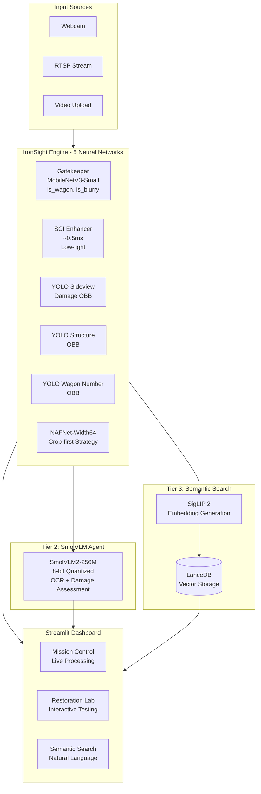
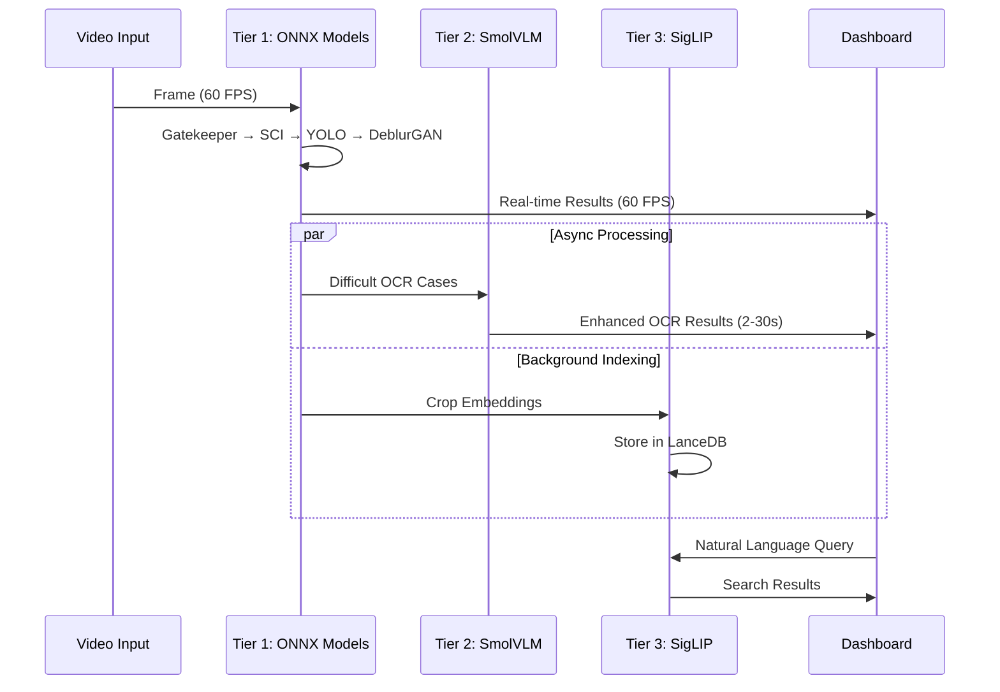

# Design Document: IronSight Command Center

## Overview

IronSight Command Center is a production-grade, real-time rail inspection dashboard that integrates 5 neural networks into a unified Streamlit interface. The system transitions from experimental models to a cohesive inspection workflow, leveraging existing trained models including DeblurGAN, SmolVLM2 forensic agent, and SigLIP semantic search.

The architecture employs a three-tier AI system:
1. **Tier 1**: Real-time ONNX models (Gatekeeper, SCI, YOLO, NAFNet) for 60 FPS processing
2. **Tier 2**: SmolVLM forensic agent for intelligent OCR fallback and damage assessment
3. **Tier 3**: SigLIP semantic search for natural language querying of inspection history

Key innovations include crop-first deblurring (85% computation reduction), SCI enhancement (6x faster than Zero-DCE), and spectral processing optimization for OCR and damage detection.

## Architecture

### High-Level System Architecture



### Three-Tier Processing Architecture



## Components and Interfaces

### 1. IronSightEngine (Main Orchestrator)

```python
class IronSightEngine:
    """
    Main engine managing 5 neural networks with optimized GPU memory usage.
    Integrates existing pipeline_core.py as foundational logic.
    """
    
    def __init__(self, config: EngineConfig):
        # Tier 1: Real-time ONNX models
        self.gatekeeper: GatekeeperModel
        self.sci_enhancer: SCIPreprocessor  # From existing preprocessor_sci.py
        self.yolo_sideview: YOLOModel
        self.yolo_structure: YOLOModel  
        self.yolo_wagon_number: YOLOModel
        self.nafnet: NAFNetModel  # Load from NAFNet-GoPro-width64.pth
        
        # Tier 2: SmolVLM forensic agent
        self.forensic_agent: SmolVLMForensicAgent  # From existing agent_forensic.py
        
        # Tier 3: Semantic search
        self.search_engine: SemanticSearchEngine  # From existing semantic_search.py
        
        # Processing pipeline from existing pipeline_core.py
        self.pipeline_core: IronSightEngine  # Reuse existing implementation
    
    def load_models(self) -> Dict[str, bool]:
        """Load all 5 neural networks with error handling."""
        pass
    
    def process_frame(self, frame: np.ndarray) -> InspectionResult:
        """Process single frame through all tiers."""
        pass
    
    def get_model_status(self) -> Dict[str, str]:
        """Return status of all models (loaded/offline)."""
        pass
```

### 2. GatekeeperModel (Pre-filter)

```python
class GatekeeperModel:
    """
    MobileNetV3-Small binary classifier for dual prediction.
    Target: <0.5ms inference on 64x64 grayscale thumbnails.
    """
    
    def __init__(self, model_path: str):
        self.session: ort.InferenceSession
        self.target_latency_ms: float = 0.5
    
    def predict(self, thumbnail: np.ndarray) -> Tuple[bool, bool]:
        """
        Joint prediction of wagon presence and blur.
        
        Args:
            thumbnail: 64x64 grayscale image
            
        Returns:
            (is_wagon_present, is_blurry) tuple
        """
        pass
    
    def preprocess(self, frame: np.ndarray) -> np.ndarray:
        """Convert frame to 64x64 grayscale thumbnail."""
        pass
```

### 3. SCIEnhancer (Fast Low-Light Enhancement)

```python
# Use existing src/preprocessor_sci.py implementation
from src.preprocessor_sci import create_sci_preprocessor

class SCIEnhancer:
    """
    Wrapper for existing SCI preprocessor with performance monitoring.
    6x faster than Zero-DCE (~0.5ms vs ~3ms).
    """
    
    def __init__(self, model_variant: str = "medium"):
        self.sci_processor = create_sci_preprocessor(
            model_variant=model_variant,
            device="cuda",
            target_size=512,
            brightness_threshold=50
        )
        self.performance_stats = PerformanceTracker()
    
    def enhance_image(self, image: np.ndarray) -> Tuple[np.ndarray, bool]:
        """
        Enhance low-light image with automatic daytime skip.
        
        Returns:
            (enhanced_image, enhancement_applied)
        """
        start_time = time.time()
        enhanced, info = self.sci_processor.enhance_image(image)
        
        # Track performance
        self.performance_stats.record_inference(
            (time.time() - start_time) * 1000
        )
        
        return enhanced, info['enhanced']
```

### 4. MultiYOLODetector (Three-Model Integration)

```python
class MultiYOLODetector:
    """
    Manages 3 specialized YOLO models and merges their detections.
    Models: sideview_damage_obb, structure_obb, wagon_number_obb
    """
    
    def __init__(self, model_paths: Dict[str, str]):
        self.sideview_model: YOLOModel
        self.structure_model: YOLOModel
        self.wagon_number_model: YOLOModel
        self.combined_latency_budget_ms: float = 20.0
    
    def detect_all(self, image: np.ndarray) -> DetectionResult:
        """
        Run all 3 YOLO models and merge results.
        
        Returns:
            DetectionResult with merged detections and metadata
        """
        results = {}
        
        # Run all models in parallel if possible
        with ThreadPoolExecutor(max_workers=3) as executor:
            futures = {
                'sideview': executor.submit(self.sideview_model.detect, image),
                'structure': executor.submit(self.structure_model.detect, image),
                'wagon_number': executor.submit(self.wagon_number_model.detect, image)
            }
            
            for name, future in futures.items():
                results[name] = future.result()
        
        # Merge detections into single JSON
        merged_result = self.merge_detections(results)
        return merged_result
    
    def merge_detections(self, results: Dict[str, List[Detection]]) -> DetectionResult:
        """Merge detections from all 3 models into unified format."""
        pass
```

### 5. CropFirstNAFNet (Optimized Processing)

```python
class CropFirstNAFNet:
    """
    NAFNet-Width64 with crop-first strategy for 85% computation reduction.
    Uses pre-trained GoPro model from NAFNet-GoPro-width64.pth
    """
    
    def __init__(self, model_path: str = "NAFNet-GoPro-width64.pth"):
        self.model = self.load_nafnet_model(model_path)
        self.crop_padding_percent: float = 0.1  # 10% padding
        self.target_latency_ms: float = 20.0
    
    def load_nafnet_model(self, model_path: str):
        """Load pre-trained NAFNet-Width64 model."""
        import torch
        from basicsr.models import create_model
        from basicsr.utils import get_root_logger
        
        # NAFNet configuration for width64
        opt = {
            'model_type': 'NAFNetModel',
            'num_gpu': 1,
            'manual_seed': 10,
            'network_g': {
                'type': 'NAFNet',
                'width': 64,
                'enc_blk_nums': [2, 2, 4, 8],
                'middle_blk_num': 12,
                'dec_blk_nums': [2, 2, 2, 2]
            },
            'path': {
                'pretrain_network_g': model_path,
                'strict_load_g': True
            }
        }
        
        model = create_model(opt)
        return model
    
    def process_identification_plates(
        self, 
        image: np.ndarray, 
        detections: List[Detection]
    ) -> Dict[str, np.ndarray]:
        """
        Process only identification_plate detections with crop-first strategy.
        
        Args:
            image: Full frame
            detections: YOLO detections (filter for identification_plate)
            
        Returns:
            Dict mapping detection_id to deblurred_crop
        """
        results = {}
        
        for detection in detections:
            if detection.class_name == "identification_plate":
                # Extract crop with padding
                crop = self.extract_crop_with_padding(image, detection)
                
                # Deblur only the crop using NAFNet
                deblurred_crop = self.nafnet_deblur(crop)
                
                results[detection.id] = deblurred_crop
        
        return results
    
    def nafnet_deblur(self, crop: np.ndarray) -> np.ndarray:
        """Apply NAFNet deblurring to crop."""
        import torch
        from torchvision.transforms import ToTensor, ToPILImage
        
        # Preprocess crop for NAFNet
        tensor_crop = ToTensor()(crop).unsqueeze(0)
        
        # Apply NAFNet
        with torch.no_grad():
            deblurred_tensor = self.model.net_g(tensor_crop)
        
        # Convert back to numpy
        deblurred_crop = ToPILImage()(deblurred_tensor.squeeze(0))
        return np.array(deblurred_crop)
    
    def extract_crop_with_padding(
        self, 
        image: np.ndarray, 
        detection: Detection
    ) -> np.ndarray:
        """Extract ROI with 10% padding on all sides."""
        h, w = image.shape[:2]
        
        # Calculate crop bounds with padding
        padding = self.crop_padding_percent
        x1 = max(0, int(detection.x - detection.width * (0.5 + padding)))
        y1 = max(0, int(detection.y - detection.height * (0.5 + padding)))
        x2 = min(w, int(detection.x + detection.width * (0.5 + padding)))
        y2 = min(h, int(detection.y + detection.height * (0.5 + padding)))
        
        return image[y1:y2, x1:x2]
```

### 6. SmolVLMIntegration (Forensic Agent)

```python
# Use existing src/agent_forensic.py implementation
from src.agent_forensic import get_forensic_agent

class SmolVLMIntegration:
    """
    Wrapper for existing SmolVLM forensic agent with specific prompts.
    """
    
    def __init__(self):
        self.forensic_agent = get_forensic_agent()
        self.ocr_prompt = "Read the serial number painted on this metal surface. Return only the alphanumeric string."
        self.damage_prompt = "Describe the damage severity: is it a dent, a hole, or rust?"
    
    def analyze_identification_plate(self, crop: np.ndarray) -> OCRResult:
        """Analyze identification plate with specific OCR prompt."""
        result = self.forensic_agent.analyze_crop(
            image=crop,
            prompt=self.ocr_prompt,
            task_type="ocr_fallback",
            blocking=True
        )
        return self.convert_to_ocr_result(result)
    
    def assess_damage(self, crop: np.ndarray, detection: Detection) -> str:
        """Assess damage with specific damage prompt."""
        result = self.forensic_agent.analyze_crop(
            image=crop,
            prompt=self.damage_prompt,
            task_type="damage_assessment",
            blocking=False  # Async for damage assessment
        )
        return result.text if result and result.success else "Assessment pending"
```

### 7. SemanticSearchIntegration (SigLIP Engine)

```python
# Use existing src/semantic_search.py implementation
from src.semantic_search import get_search_engine

class SemanticSearchIntegration:
    """
    Wrapper for existing SigLIP semantic search with UI integration.
    """
    
    def __init__(self):
        self.search_engine = get_search_engine()
        self.embedding_queue_size = 1000
    
    def add_inspection_crop(
        self, 
        crop: np.ndarray, 
        inspection_result: InspectionResult
    ) -> bool:
        """Add crop to semantic search index (background processing)."""
        return self.search_engine.add_wagon_embedding(
            image_array=crop,
            image_path=inspection_result.image_path,
            inspection_result=inspection_result.to_dict(),
            priority=False  # Background processing
        )
    
    def search_natural_language(
        self, 
        query: str, 
        limit: int = 10
    ) -> List[SearchResult]:
        """Search using natural language queries."""
        return self.search_engine.search(
            query=query,
            limit=limit,
            min_confidence=0.0
        )
```

## Data Models

### Configuration

```python
@dataclass
class EngineConfig:
    """Configuration for IronSight Engine."""
    # Model paths
    gatekeeper_model_path: str = "models/gatekeeper.onnx"
    yolo_sideview_path: str = "models/yolo_sideview_damage_obb_extended.pt"
    yolo_structure_path: str = "models/yolo_structure_obb.pt"
    yolo_wagon_number_path: str = "models/wagon_number_obb.pt"
    nafnet_model_path: str = "NAFNet-GoPro-width64.pth"
    
    # Performance settings
    target_fps: int = 60
    gatekeeper_timeout_ms: float = 0.5
    sci_timeout_ms: float = 0.5
    yolo_combined_timeout_ms: float = 20.0
    nafnet_timeout_ms: float = 20.0
    
    # Memory optimization
    use_fp16: bool = True
    smolvlm_quantization_bits: int = 8
    gpu_memory_fraction: float = 0.8
    
    # UI settings
    theme: str = "dark_industrial"
    enable_performance_monitoring: bool = True
```

### Detection Results

```python
@dataclass
class DetectionResult:
    """Merged detection result from all 3 YOLO models."""
    sideview_detections: List[Detection]
    structure_detections: List[Detection]
    wagon_number_detections: List[Detection]
    combined_json: Dict[str, Any]
    processing_time_ms: float
    model_status: Dict[str, bool]  # Which models succeeded
```

### Inspection Result

```python
@dataclass
class InspectionResult:
    """Complete inspection result with all processing stages."""
    frame_id: int
    timestamp: datetime
    
    # Gatekeeper results
    is_wagon_present: bool
    is_blurry: bool
    gatekeeper_time_ms: float
    
    # Enhancement results
    enhancement_applied: bool
    sci_time_ms: float
    
    # Detection results
    detection_result: DetectionResult
    yolo_time_ms: float
    
    # Deblurring results
    deblurred_crops: Dict[str, np.ndarray]
    nafnet_time_ms: float
    
    # OCR and damage assessment
    ocr_results: Dict[str, str]  # detection_id -> text
    damage_assessments: Dict[str, str]  # detection_id -> assessment
    smolvlm_time_ms: float
    
    # Performance metrics
    total_processing_time_ms: float
    fps_achieved: float
    
    # Semantic search
    indexed_for_search: bool
    embedding_generation_queued: bool
```

## Correctness Properties

*A property is a characteristic or behavior that should hold true across all valid executions of a system—essentially, a formal statement about what the system should do. Properties serve as the bridge between human-readable specifications and machine-verifiable correctness guarantees.*

### Property 1: Multi-Model Loading Success
*For any* IronSight Engine initialization, all 5 neural networks (Gatekeeper, SCI, YOLO×3, DeblurGAN) SHALL be loaded successfully or return specific error status for each failed model.
**Validates: Requirements 1.1**

### Property 2: GPU Memory Optimization
*For any* model loading sequence, GPU VRAM usage SHALL be optimized through FP16 quantization and the total memory usage SHALL not exceed the configured memory fraction.
**Validates: Requirements 1.2**

### Property 3: Gatekeeper Dual Output Format
*For any* 64x64 grayscale input, the Gatekeeper SHALL return exactly two boolean values representing `[is_wagon_present, is_blurry]`.
**Validates: Requirements 3.2**

### Property 4: Gatekeeper Performance Constraint
*For any* 64x64 grayscale thumbnail, Gatekeeper processing SHALL complete within 0.5ms.
**Validates: Requirements 3.1**

### Property 5: SCI Enhancement Performance
*For any* single-channel image input, SCI enhancement SHALL complete within 0.5ms target time.
**Validates: Requirements 4.1**

### Property 6: SCI Brightness Skip Logic
*For any* image with mean brightness > 50, SCI enhancement SHALL be automatically skipped and the original image returned.
**Validates: Requirements 4.2**

### Property 7: YOLO Detection Merging
*For any* image processed by all 3 YOLO models, the output SHALL be merged into a single JSON result containing detections from all models.
**Validates: Requirements 5.2**

### Property 8: Crop-First Processing Logic
*For any* frame with identification_plate detections, NAFNet SHALL process only the cropped regions and not the full frame.
**Validates: Requirements 6.1**

### Property 9: Crop Padding Correctness
*For any* detection bounding box, the extracted crop SHALL include exactly 10% padding on all sides.
**Validates: Requirements 6.2**

### Property 10: Spectral Channel Extraction
*For any* BGR image, red channel extraction SHALL equal `image[:,:,2]` and saturation channel extraction SHALL equal the S channel from HSV conversion.
**Validates: Requirements 10.1, 10.2**

### Property 11: Video Input Acceptance
*For any* valid video input (webcam, RTSP, file upload), the Mission Control interface SHALL accept and begin processing the input.
**Validates: Requirements 2.1**

### Property 12: Real-time Overlay Display
*For any* processed frame with detections, Mission Control SHALL display oriented bounding box overlays from all 3 YOLO models with different colors.
**Validates: Requirements 2.2**

### Property 13: Natural Language Query Processing
*For any* text query input to Semantic Search, the system SHALL generate embeddings and compare against stored crop embeddings using SigLIP.
**Validates: Requirements 9.1, 9.2**

### Property 14: Model Status Reporting
*For any* model that fails to load, the Dashboard SHALL display a "Model Offline" badge for that specific component.
**Validates: Requirements 1.4**

### Property 15: ONNX Model Loading
*For any* ONNX model file, the system SHALL load it with FP16 precision where supported.
**Validates: Requirements 13.1**

## Error Handling

### Model Loading Failures

```python
class ModelLoadingManager:
    """Handles graceful degradation when models fail to load."""
    
    def load_models_with_fallback(self) -> Dict[str, ModelStatus]:
        """
        Load all models with individual error handling.
        
        Returns:
            Dict mapping model_name to ModelStatus (LOADED/OFFLINE/ERROR)
        """
        model_status = {}
        
        # Load each model independently
        for model_name, model_path in self.model_paths.items():
            try:
                model = self.load_single_model(model_name, model_path)
                model_status[model_name] = ModelStatus.LOADED
            except Exception as e:
                logger.error(f"Failed to load {model_name}: {e}")
                model_status[model_name] = ModelStatus.OFFLINE
                
                # Create mock model for graceful degradation
                self.models[model_name] = self.create_mock_model(model_name)
        
        return model_status
    
    def create_mock_model(self, model_name: str):
        """Create mock model that returns safe defaults."""
        if model_name == "gatekeeper":
            return MockGatekeeper()  # Always returns (True, False)
        elif "yolo" in model_name:
            return MockYOLO()  # Returns empty detection list
        # ... etc
```

### Performance Monitoring and Fallbacks

```python
class PerformanceMonitor:
    """Monitors processing times and triggers fallbacks."""
    
    def __init__(self):
        self.latency_budgets = {
            'gatekeeper': 0.5,
            'sci': 0.5,
            'yolo_combined': 20.0,
            'deblur': 20.0,
            'total': 60.0  # For 60 FPS
        }
        self.performance_history = defaultdict(list)
    
    def check_performance(self, stage: str, actual_time_ms: float) -> bool:
        """
        Check if processing time meets budget.
        
        Returns:
            True if within budget, False if exceeded
        """
        budget = self.latency_budgets.get(stage, float('inf'))
        within_budget = actual_time_ms <= budget
        
        # Log performance violation
        if not within_budget:
            overage_pct = (actual_time_ms - budget) / budget * 100
            logger.warning(
                f"Performance violation: {stage} took {actual_time_ms:.2f}ms "
                f"(budget: {budget}ms, overage: {overage_pct:.1f}%)"
            )
        
        # Track history
        self.performance_history[stage].append(actual_time_ms)
        
        return within_budget
```

## Testing Strategy

### Unit Tests

Unit tests verify specific functionality and edge cases:

1. **Model Loading Tests**
   - Test successful loading of all 5 models
   - Test graceful handling of missing model files
   - Test memory usage optimization

2. **Gatekeeper Tests**
   - Test dual prediction output format
   - Test performance on 64x64 thumbnails
   - Test accuracy on known wagon/non-wagon images

3. **SCI Enhancement Tests**
   - Test brightness-based skip logic
   - Test performance on various image sizes
   - Test enhancement quality metrics

4. **YOLO Integration Tests**
   - Test detection merging from 3 models
   - Test oriented bounding box handling
   - Test performance within latency budget

5. **Crop-First Deblurring Tests**
   - Test crop extraction with correct padding
   - Test processing only identification_plate detections
   - Test deblurring quality on real crops

### Property-Based Tests

Property-based tests verify universal properties using **Hypothesis** (Python PBT library).

Configuration:
- Minimum 100 iterations per property test
- Each test tagged with: **Feature: ironsight-command-center, Property N: [property_text]**

**Test Categories:**

1. **Performance Properties (P4, P5)**
   ```python
   @given(st.integers(min_value=1, max_value=100), 
          st.integers(min_value=1, max_value=100))
   def test_gatekeeper_performance(height: int, width: int):
       """
       Feature: ironsight-command-center, Property 4: Gatekeeper Performance Constraint
       For any 64x64 grayscale thumbnail, Gatekeeper processing SHALL complete within 0.5ms.
       **Validates: Requirements 3.1**
       """
       thumbnail = np.random.randint(0, 256, (64, 64), dtype=np.uint8)
       
       start_time = time.time()
       is_wagon, is_blurry = gatekeeper.predict(thumbnail)
       processing_time_ms = (time.time() - start_time) * 1000
       
       assert processing_time_ms <= 0.5
       assert isinstance(is_wagon, bool)
       assert isinstance(is_blurry, bool)
   ```

2. **Format Properties (P3, P7, P10)**
   ```python
   @given(st.integers(min_value=1, max_value=512),
          st.integers(min_value=1, max_value=512))
   def test_spectral_channel_extraction(height: int, width: int):
       """
       Feature: ironsight-command-center, Property 10: Spectral Channel Extraction
       For any BGR image, red channel extraction SHALL equal image[:,:,2] and 
       saturation channel extraction SHALL equal the S channel from HSV conversion.
       **Validates: Requirements 10.1, 10.2**
       """
       bgr_image = np.random.randint(0, 256, (height, width, 3), dtype=np.uint8)
       
       red_channel = extract_red_channel(bgr_image)
       saturation_channel = extract_saturation_channel(bgr_image)
       
       # Verify red channel
       assert np.array_equal(red_channel, bgr_image[:, :, 2])
       
       # Verify saturation channel
       hsv = cv2.cvtColor(bgr_image, cv2.COLOR_BGR2HSV)
       assert np.array_equal(saturation_channel, hsv[:, :, 1])
   ```

3. **Conditional Logic Properties (P6, P8)**
   ```python
   @given(st.integers(min_value=0, max_value=255))
   def test_sci_brightness_skip_logic(mean_brightness: int):
       """
       Feature: ironsight-command-center, Property 6: SCI Brightness Skip Logic
       For any image with mean brightness > 50, SCI enhancement SHALL be 
       automatically skipped and the original image returned.
       **Validates: Requirements 4.2**
       """
       # Create image with specific mean brightness
       image = np.full((100, 100, 3), mean_brightness, dtype=np.uint8)
       
       enhanced, info = sci_enhancer.enhance_image(image)
       
       if mean_brightness > 50:
           assert not info['enhanced']
           assert np.array_equal(enhanced, image)
       else:
           # Enhancement may or may not be applied based on other factors
           pass
   ```

### Integration Tests

1. **End-to-End Pipeline Test**
   - Test complete frame processing through all tiers
   - Verify real-time performance on video streams
   - Test dashboard integration with live data

2. **Multi-Model Integration Test**
   - Test all 5 models working together
   - Verify memory usage stays within limits
   - Test graceful degradation when models fail

3. **UI Integration Test**
   - Test all 3 dashboard tabs functionality
   - Verify real-time updates and visualizations
   - Test file upload and processing workflows

### Test File Structure

```
tests/
├── unit/
│   ├── test_gatekeeper.py
│   ├── test_sci_enhancer.py
│   ├── test_multi_yolo.py
│   ├── test_deblur_gan.py
│   └── test_smolvlm_integration.py
├── property/
│   ├── test_performance_properties.py
│   ├── test_format_properties.py
│   ├── test_conditional_properties.py
│   └── test_integration_properties.py
├── integration/
│   ├── test_engine_integration.py
│   ├── test_dashboard_integration.py
│   └── test_end_to_end.py
└── fixtures/
    ├── sample_images/
    ├── mock_models/
    └── test_configs/
```